# Speed CoCat

## Descrição:
Bem-vindo ao Speedy CoCat, um jogo emocionante desenvolvido em Java com a tecnologia JavaFX. Neste jogo, você controla um gato ágil que deve pular de uma plataforma para outra enquanto evita obstáculos perigosos que podem derrubá-lo. Dentre os céus, nuvens e aviões, seu objetivo é simples: alcançar a maior pontuação possível subindo o mais alto que puder!

## Como jogar:
- Movimento: Use as teclas específicas para mover o gato para a esquerda, direita e para pular.
- Plataformas: Pule de uma plataforma para outra e continuar subindo.
- Obstáculos em Movimento: Fique atento aos obstáculos em movimento. Evite-os para não cair e perder o jogo.
- Pontuação: Continue subindo o mais alto que puder para alcançar a maior pontuação possível.

## Ferramnetas utilizadas:
- *Linguagem de Programação*: Java 21+
- *Biblioteca Gráfica*: JavaFX 21+
- *Controle de Versão*: Git
- *Hospedagem de Código*: GitHub
- *Metodologia Ágil*: Scrum
- *IDE*: IntelliJ IDEA

## Regras e Mecanismos: 
Permanecer o máximo possível pulando entre plataformas, subindo a pontuação enquanto a tela avança continuamente.

Se o player cair fora das plataformas ou ser atingido por algum obstáculo e não conseguir alcançar uma plataforma, o jogo termina.

Controles:
Mover (pular, direita, esquerda)

Interação com plataformas (saltá-las)

Interação com obstáculos (saltar)

## Pesquisa e Inspiração:
Esse jogo foi baseado no app mobile POU, o qual temos uma espécie de "pet" virtual onde é possível abrir um seletor de jogos internos com varias opções, dentre eles o SKY JUMP com um objetivo simples: Vá de uma plataforma para outra enquanto você tenta não cair no vazio. 

Acesse o link para referência: https://youtube.com/shorts/gebBM5YTWbE?si=araHty7H0jiX_ai-

## Descrição de funcionamento (técnico):
### Classes
    ScreenController gerencia as transições entre telas e a lógica do jogo, incluindo inicialização, controle de movimentos do jogador, colisões, atualização de plataformas e obstáculos, pausa e fim de jogo.

    Game é a classe principal que inicializa o jogo JavaFX. Ela carrega o arquivo FXML que define o menu principal (GameMenu.fxml), cria uma cena com base nesse arquivo FXML, adiciona um arquivo CSS para estilização, define o título da janela do jogo, e mostra a cena na janela do jogo. O método main() é o ponto de entrada do aplicativo Java e invoca o método launch() para iniciar o aplicativo JavaFX.

    Player representa o jogador do jogo, estendendo ImageView do JavaFX para exibir uma imagem do jogador. Ela controla a física do jogador, incluindo movimento, pulo, gravidade, atrito e detecção de colisão através de uma caixa de colisão invisível.

    Plataform é responsável por representar uma plataforma no jogo, estendendo ImageView do JavaFX para exibir uma imagem de plataforma. O construtor carrega uma imagem específica para a plataforma, define sua posição inicial e ajusta seu tamanho de acordo com os parâmetros fornecidos. Se a imagem não for encontrada, uma mensagem de erro é exibida no console.

    MovingObstacle representa um obstáculo móvel no jogo, derivando da classe Plataform. Ela adiciona funcionalidade para movimento horizontal, onde o obstáculo alterna sua direção ao atingir as bordas da tela. O construtor inicializa a posição e o tamanho do obstáculo móvel com base nos parâmetros fornecidos.

    classe SoundEffect é responsável por gerenciar e reproduzir efeitos sonoros no jogo. Ela utiliza a API MediaPlayer do JavaFX para carregar e controlar arquivos de áudio especificados pelo caminho audioPath. O construtor inicializa o reprodutor de mídia com o arquivo de áudio correspondente e configura a repetição indefinida se o áudio deve ser reproduzido em loop. Os métodos play() e stop() são utilizados para iniciar e parar a reprodução do áudio, respectivamente.

 

## Diagrama de Classes:

## Diagrama de Sequência

```mermaid
sequenceDiagram
    participant User
    participant Game
    participant ScreenController
    participant Player
    participant Platform
    participant MovingObstacle
    participant SoundEffect
    participant GameOverScreen

    User ->> Game: Launch Game
    Game ->> ScreenController: setStage(Stage)
    User ->> ScreenController: click playButton
    ScreenController ->> ScreenController: switchToLoad(ActionEvent)
    activate ScreenController
    ScreenController ->> ScreenController: gameStart()
    deactivate ScreenController
    
    ScreenController ->>+ Player: Create Player
    ScreenController ->>+ Platform: Create Initial Platforms
    ScreenController ->>+ MovingObstacle: Create Initial Moving Obstacles
    ScreenController ->> SoundEffect: Play backgroundMusic
    
    Note over ScreenController, Player: Game Loop Starts
    User ->> ScreenController: Press Key (LEFT or RIGHT)
    ScreenController ->> Player: moveLeft() or moveRight()
    ScreenController ->> Player: update()
    
    ScreenController ->> ScreenController: updateMovingObstacles()
    ScreenController ->> ScreenController: checkCollisions()
    ScreenController ->> ScreenController: scrollScreen()

    ScreenController ->> Player: setOnPlatform(true or false)
    ScreenController ->> SoundEffect: Play jumpSound if Collision Detected
    ScreenController ->> Platform: Update Score if Collision Detected
    
    ScreenController ->> ScreenController: gameOver() if Player Falls Below Screen
    ScreenController ->> SoundEffect: Play gameOverSound if Player Falls Below Screen

    ScreenController ->> GameOverScreen: Show Game Over Screen
    GameOverScreen ->> ScreenController: Restart game
    GameOverScreen ->> Game: Go to main menu

```

